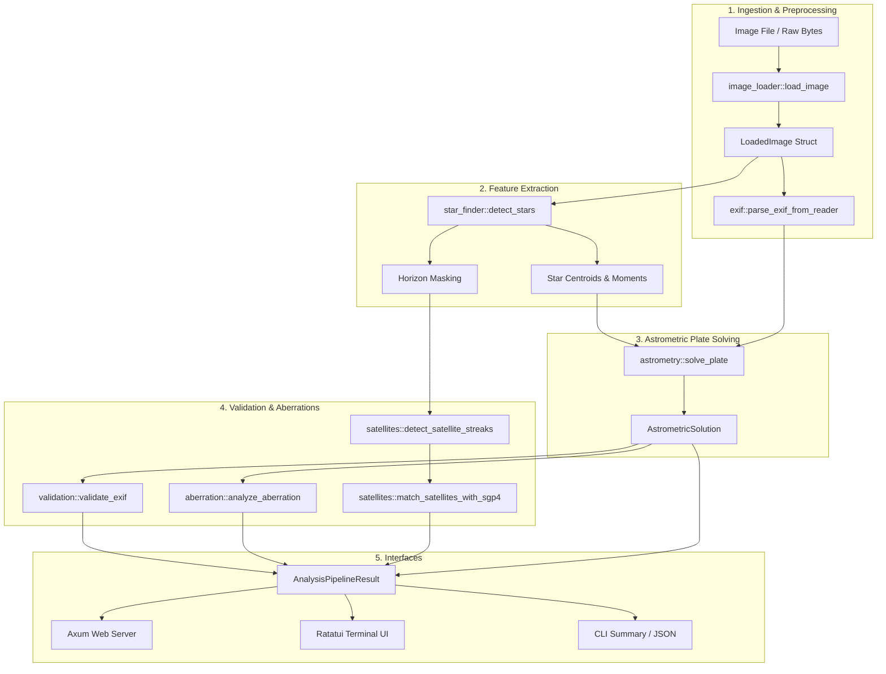

# ✦ stars ✦ — iPhone Astrophotography Suite

[](https://deepwiki.com/plops/stars)
[](https://www.rust-lang.org/)
[](https://github.com/tokio-rs/axum)
[](https://github.com/ratatui/ratatui)
[](https://github.com/jfecher/sgp4)
[](LICENSE)

A high-performance, end-to-end Rust platform for **smartphone and iPhone astrophotography analysis**. `stars` combines computer vision, optical lens modeling, astrometric plate solving, and satellite orbit propagation into a unified suite delivered across **Web API / HTML5 Canvas**, **Ratatui Terminal UI (TUI)**, and **CLI** interfaces.

---

## 🌟 Key Features

*   **Adaptive Star Finder & Ground Landscape Masking**
    *   2D adaptive mesh background grid ($16 \times 12$ local cell medians $\mu_{\text{local}}$ and MAD $\sigma_{\text{local}}$).
    *   3×3 sub-pixel barycenter centroiding for point-source star localization.
    *   Point Spread Function (PSF) peak sharpness ratio validation ($\frac{I_{\text{peak}} - \text{bg}}{\bar{I}_{\text{surround}} - \text{bg}} \ge 1.08$).
    *   Sobel vertical gradient horizon edge detector to automatically mask terrestrial foliage, buildings, and vehicles.

*   **Astrometric Plate Solver & SIP Distortion Modeling**
    *   Externalized Hipparcos bright star catalog ($\le 6.5\text{ mag}$, 8,785 stars loaded from CSV/embedded fallback).
    *   Iterative camera altitude estimator replacing hardcoded elevation assumptions.
    *   SIP (Simple Imaging Polynomial) 2D distortion model fitting ($A_{p,q}, B_{p,q}$ coefficients up to order 4).
    *   Gnomonic celestial projection with fast `kiddo` KD-Tree spatial indexing.
    *   Sub-pixel matching accuracy ($0.73 - 1.16\text{ px}$ RMS residual error).

*   **EXIF Metadata Validation & Directional Residual Drift Detection**
    *   Extracts iPhone EXIF tags: GPS coordinates (DMS decimal conversion), UTC timestamp, compass direction (`GPSImgDirection`), focal length ($35\text{mm}$ equivalent), exposure time, ISO, F-number.
    *   Signed directional residual analysis ($\Delta x, \Delta y$) for systematic heading adjustment ($\Delta \theta^\circ$) and Earth rotation time drift ($\Delta t$ seconds).

*   **Camera Optical Aberration & Refraction Engine**
    *   Brown-Conrady radial lens distortion polynomial ($k_1, k_2$) and SIP polynomial model.
    *   PSF elongation analysis (coma and astigmatism parameters).
    *   Chromatic aberration offset (px) and Bennett's atmospheric refraction modeling integrated into projection.
    *   Composite **Optical Quality Score Index** ($0 - 100$).

*   **RANSAC Satellite Streak Tracker & SGP4**
    *   RANSAC 2D line segment detection filtering linear light trails (Pearson $R^2 \ge 0.88$).
    *   Streak intensity uniformity validation (Coefficient of Variation $\le 0.28$) and multi-point open sky isolation checking to prevent false positives from terrestrial vehicle roof lines or streetlights.
    *   SGP4 orbital propagation matching streaks against NORAD TLE satellite data (e.g. ISS 25544).

*   **Triple User Interface Options**
    *   **Axum Web Dashboard**: Single-page application with Base64 canvas rendering, smooth mouse wheel zoom ($0.5\times - 15\times$), click-and-drag panning, HUD cursor coordinate tracker, dynamic sensitivity threshold slider, and 5 detail tabs.
    *   **Ratatui Terminal UI (TUI)**: Interactive 5-tab terminal dashboard with real-time ASCII star field visualizer.
    *   **CLI Mode**: Batch image processing and structured JSON exports (`--export-json`).

---

## 🏗 System Architecture



---

## 📦 Project Structure

```
stars/
├── build_release.sh           # Optimized release compilation script
├── Cargo.toml                 # Dependencies & package manifest
├── deps.md                    # Detailed crate dependencies documentation
├── README.md                  # Project documentation & overview
├── src/
│   ├── main.rs                # CLI entry point, argument parsing & dispatch
│   ├── lib.rs                 # Core library exports
│   ├── exif/                  # EXIF tag reader & DMS decimal converter
│   ├── image_loader/          # Image decoding & 2D Gaussian PSF synthetic generator
│   ├── star_finder/           # Adaptive background grid, PSF sharpness & horizon mask
│   ├── astrometry/            # Embedded catalog, gnomonic solver & KD-Tree index
│   ├── validation/            # EXIF time drift & heading error validator
│   ├── aberration/            # Radial distortion k1/k2, coma, astigmatism & refraction
│   ├── satellites/            # RANSAC streak finder & SGP4 TLE propagator
│   ├── tui/                   # Ratatui terminal dashboard renderer (5 tabs)
│   └── web/                   # Axum REST server & HTML5 Canvas interactive viewer
└── tests/
    └── integration_tests.rs   # End-to-end integration test suite
```

---

## ⚡ Quickstart & Installation

### Prerequisites
*   [Rust toolchain](https://rustup.rs/) (v1.75+ recommended)

### Build Executable
Compile an optimized production binary using the build script:

```bash
chmod +x build_release.sh
./build_release.sh
```

Or using Cargo directly:

```bash
cargo build --release
```

The resulting binary will be located at `target/release/stars`.

---

## 🚀 Usage Guide

### 1. Command-Line Interface (CLI)
Analyze a single image file:

```bash
./target/release/stars --image /path/to/stars.jpg
```

Export detailed JSON analysis report:

```bash
./target/release/stars --image /path/to/stars.jpg --export-json analysis_report.json
```

Generate synthetic test image analysis (if no image path provided):

```bash
./target/release/stars
```

### 2. Axum Web Application Server
Launch the interactive web viewer on port 5001:

```bash
./target/release/stars --web --port 5001
```

Open `http://localhost:5001` in your browser. Features include:
*   **Mouse Wheel Zoom**: Smooth zoom in/out ($50\% - 1500\%$).
*   **Click & Drag Pan**: Drag to move across zoomed sky regions.
*   **Sensitivity Threshold Slider**: Live-tune detection sensitivity ($1.0\sigma - 5.0\sigma$).
*   **5 Dashboard Tabs**: Overview, Solved Catalog Table, EXIF Validation, Optical Aberrations, and Satellite Orbit Propagations.

### 3. Ratatui Terminal UI (TUI)
Launch the interactive 5-tab terminal dashboard:

```bash
./target/release/stars --image /path/to/stars.jpg --tui
```

Navigation in TUI:
*   `Tab` / `Shift+Tab`: Switch tabs.
*   `1` – `5`: Jump directly to tab.
*   `q` / `Esc`: Exit application.

---

## 🧪 Testing & Quality Assurance

Run all unit and integration tests:

```bash
cargo test
```

Run Clippy linter checks:

```bash
cargo clippy -- -W clippy::all
```

Check code formatting:

```bash
cargo fmt -- --check
```

---

## 📄 License

Distributed under the MIT License. See `LICENSE` for details.
